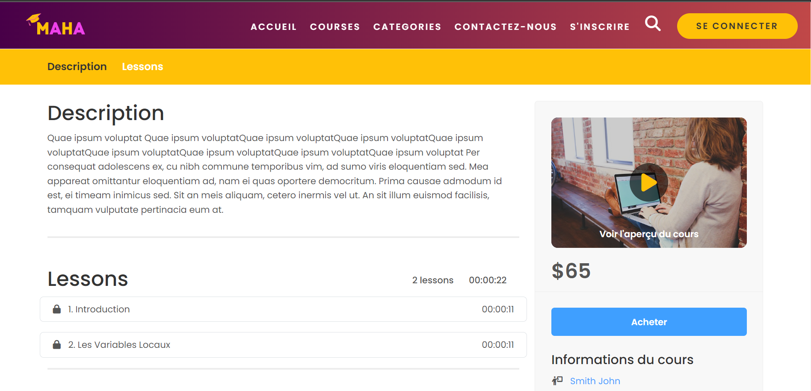
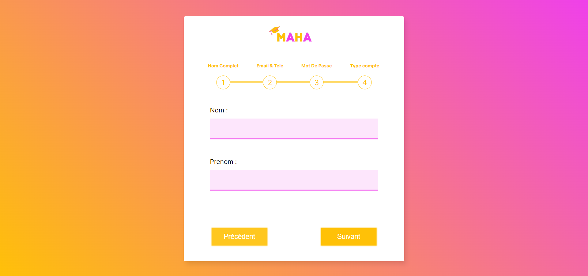

# MAHA
Welcome to the E-Learning Platform repository! This platform is designed to provide a robust and intuitive learning 
environment for educators and learners. It offers a range of features to enhance the learning experience, 
including seamless media storage, integrated payment options, customizable administration tools, and more.

## Features

- Media Localization: Store and manage video, images, and assets directly within the platform for easy access.
- Payment Integration: Seamlessly handle transactions with integrated PayPal functionality.
- Customizable Administration: Customize SMTP configuration, access enhanced statistics, and enjoy an improved admin dashboard.
- Social Login: Users can register and log in using their Facebook or Google accounts for convenience.

## Screenshots

